# Small Office Network

## Overview

This project simulates the design and deployment of a small office network using Cisco Packet Tracer. The objective is to build a reliable and scalable Local Area Network (LAN) that provides connectivity between end devices while following networking best practices.

The project demonstrates the implementation of fundamental networking concepts, including IPv4 addressing, router and switch configuration, network verification, and technical documentation.

---

## Scenario

A small technology company has recently established a new office and requires a functional network infrastructure for its daily operations.

As the network engineer, the objective is to design, configure, and validate a wired network that enables communication between all connected devices while providing a foundation for future network expansion.

---

## Objectives

- Design a small office network topology.
- Configure a Cisco router.
- Configure a Cisco Layer 2 switch.
- Configure end devices with static IPv4 addressing.
- Configure a switch management interface.
- Verify end-to-end connectivity.
- Document the complete network implementation.

---

## Network Topology

The network consists of the following devices:

| Device          | Quantity |
|-----------------|---------:|
| Cisco Router    |     1    |
| Cisco Switch    |     1    |
| PCs             |     2    |
| Server          |     1    |
| Network Printer |     1    |

The following diagram illustrates the physical topology of the network.

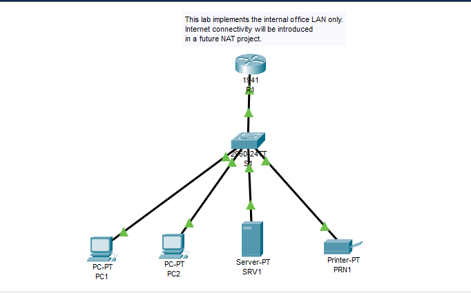

---

## IP Addressing Plan

| Device  | Interface          | IP Address    | Subnet Mask   | Default Gateway |
|---------|--------------------|---------------|---------------|-----------------|
| R1      | GigabitEthernet0/0 | 192.168.10.1  | 255.255.255.0 | N/A             |
| S1      | VLAN 1             | 192.168.10.2  | 255.255.255.0 | 192.168.10.1    |
| SRV1    | FastEthernet0      | 192.168.10.5  | 255.255.255.0 | 192.168.10.1    |
| PC1     | FastEthernet0      | 192.168.10.10 | 255.255.255.0 | 192.168.10.1    |
| PC2     | FastEthernet0      | 192.168.10.11 | 255.255.255.0 | 192.168.10.1    |
| PRN1    | FastEthernet0      | 192.168.10.20 | 255.255.255.0 | 192.168.10.1    |

---

## Project Structure

```text
01-Small-Office-Network/
│
├── README.md
├── Small-Office-Network.pkt
│
├── configs/
│   ├── R1.txt
│   └── S1.txt
│
├── screenshots/
│   ├── network-topology.png
│   ├── router-running-config.png
│   ├── switch-running-config.png
│   ├── pc1-ip-configuration.png
│   ├── pc2-ip-configuration.png
│   ├── server-ip-configuration.png
│   ├── printer-ip-configuration.png
│   ├── printer-ip-settings.png
│   ├── ping-pc1-to-router.png
│   ├── ping-pc1-to-end-devices.png
│   └── ping-router-to-end-devices.png
│
└── notes/
    └── observations.md
```

---

## Configuration Tasks

### Router (R1)

- Configure the hostname.
- Configure the GigabitEthernet0/0 interface.
- Assign the IPv4 address.
- Enable the interface.
- Save the running configuration.

Configuration file:

```text
configs/R1.txt
```

### Switch (S1)

- Configure the hostname.
- Configure the VLAN 1 management interface.
- Configure the default gateway.
- Save the running configuration.

Configuration file:

```text
configs/S1.txt
```

### End Devices

- Configure static IPv4 addresses.
- Configure subnet masks.
- Configure default gateways.
- Verify network connectivity.

---

## Configuration Evidence

### Router Running Configuration

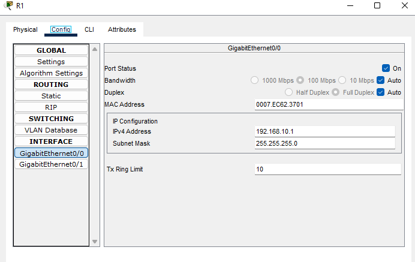

### Switch Running Configuration

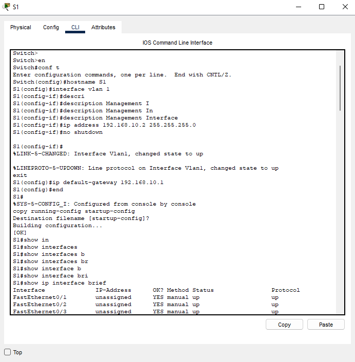

### PC1 IP Configuration

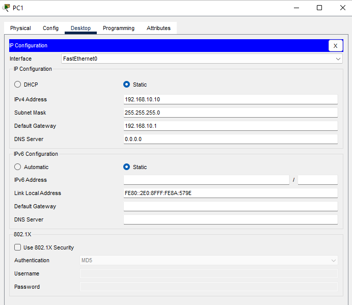

### PC2 IP Configuration

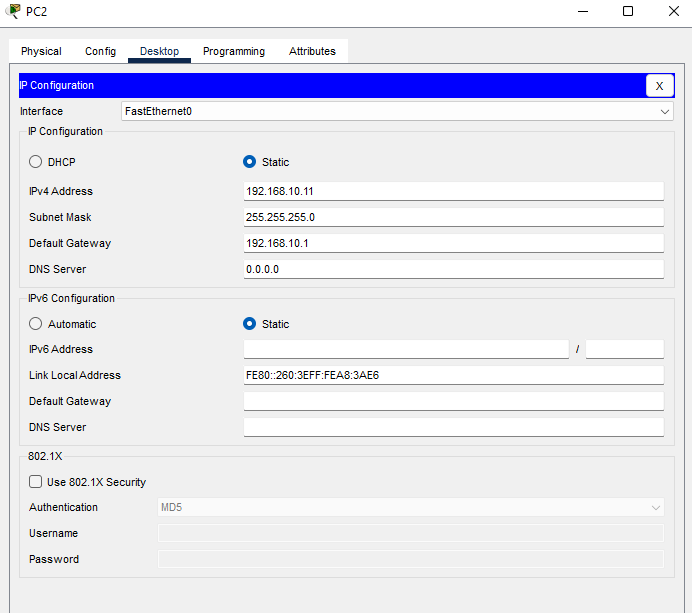

### Server IP Configuration

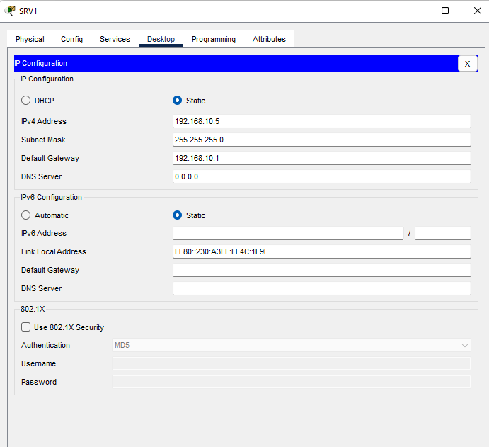

### Printer IP Configuration

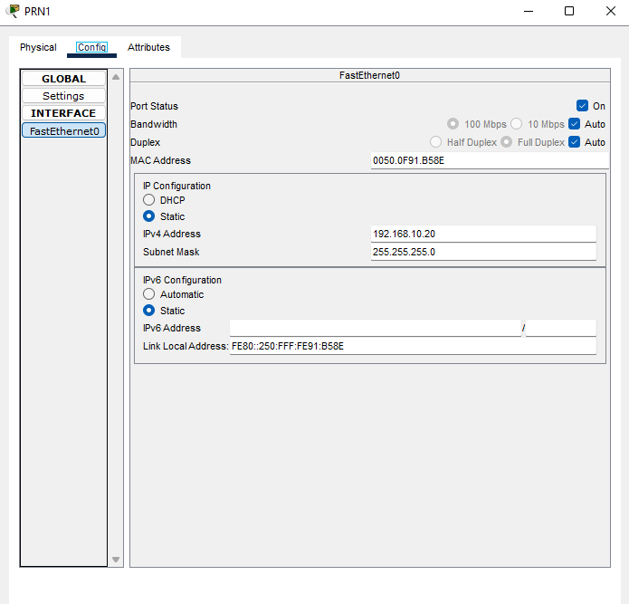

### Printer Network Settings

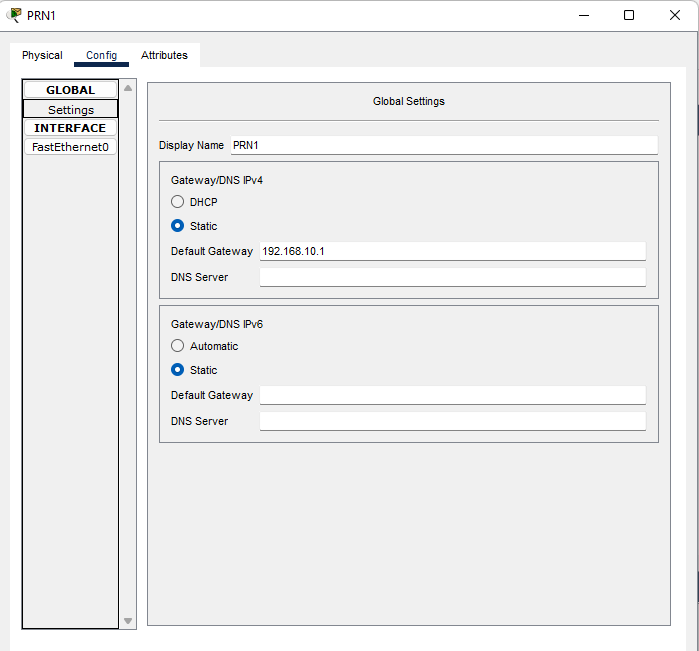

---

## Connectivity Verification

Connectivity was verified using ICMP Echo Requests after completing the configuration.

### PC1 to Router

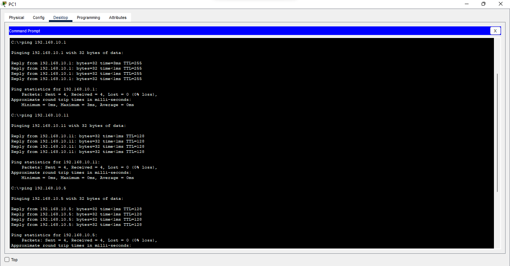

### PC1 to End Devices

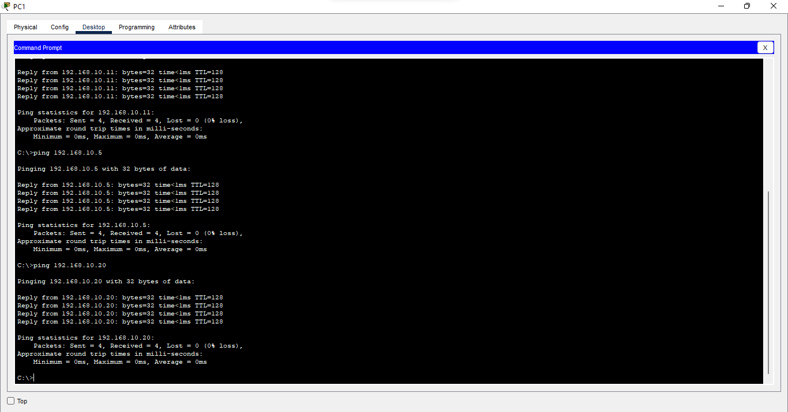

### Router to End Devices

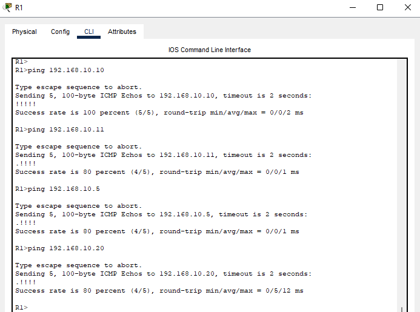

All devices successfully exchanged ICMP Echo Request and Echo Reply messages.

---

## Technologies Used

- Cisco Packet Tracer
- Cisco IOS
- Ethernet
- IPv4
- ICMP

---

## Skills Demonstrated

- Network topology design
- IPv4 addressing
- Cisco IOS configuration
- Router configuration
- Layer 2 switch configuration
- Switch management interface configuration
- Static host configuration
- Network verification using ICMP
- Basic network troubleshooting
- Technical documentation

---

## Files

| File                     | Description                                           |
|--------------------------|-------------------------------------------------------|
| Small-Office-Network.pkt | Cisco Packet Tracer project                           |
| configs/                 | Router and switch configuration files                 |
| screenshots/             | Topology, configuration, and verification screenshots |
| notes/                   | Project observations and documentation                |

---

## Future Improvements

This network can be extended by implementing:

- Dynamic Host Configuration Protocol (DHCP)
- Virtual Local Area Networks (VLANs)
- Inter-VLAN Routing
- Access Control Lists (ACLs)
- Network Address Translation (NAT)
- Dynamic Routing Protocols
- Internet connectivity
- Network monitoring and management

---

## Author

**Ziad ZARABI**

Networking Portfolio

GitHub Repository: **Networking-Labs**