# Two LANs with Static Routing

## Overview

This project simulates the design and deployment of two interconnected Local Area Networks (LANs) using Cisco Packet Tracer. The objective is to establish end-to-end communication between two separate office networks through static routing while following networking best practices.

The project demonstrates the implementation of fundamental routing concepts, including IPv4 addressing, router and switch configuration, static route configuration, network verification, and technical documentation.

---

## Scenario

A growing company has expanded its operations by opening a second office at a different location. Each office operates its own Local Area Network (LAN), and both locations must communicate securely through dedicated routers.

As the network engineer, the objective is to configure the network infrastructure, establish connectivity between both LANs using static routing, and validate successful communication between all connected devices.

---

## Objectives

- Design a network topology containing two separate LANs.
- Configure two Cisco routers.
- Configure two Cisco Layer 2 switches.
- Configure end devices with static IPv4 addressing.
- Configure switch management interfaces.
- Configure static routes between both routers.
- Verify end-to-end communication across both LANs.
- Document the complete network implementation.

---

## Network Topology

The network consists of the following devices:

| Device          | Quantity |
|-----------------|---------:|
| Cisco Router    |    2     |
| Cisco Switch    |    2     |
|     PCs         |    2     |
|      Server     |    1     |
| Network Printer |    1     |

The following diagram illustrates the physical topology of the network.

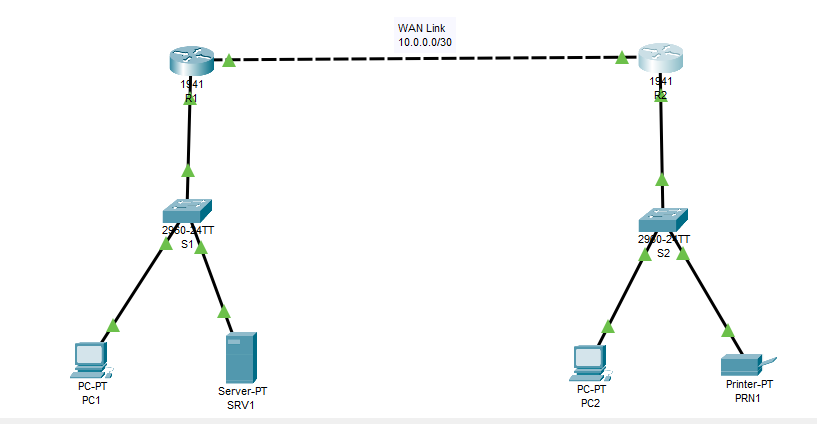

---

## IP Addressing Plan

| Device     | Interface          |  IP Address   | Subnet Mask     | Default Gateway |
|------------|--------------------|---------------|-----------------|-----------------|
|      R1    | GigabitEthernet0/0 | 192.168.10.1  | 255.255.255.0   | N/A             |
|      R1    | GigabitEthernet0/1 | 10.0.0.1      | 255.255.255.252 | N/A             |
|      S1    |       VLAN 1       | 192.168.10.2  | 255.255.255.0   | 192.168.10.1    |
|      PC1   |    FastEthernet0   | 192.168.10.10 | 255.255.255.0   | 192.168.10.1    |
|     SRV1   |    FastEthernet0   | 192.168.10.20 | 255.255.255.0   | 192.168.10.1    |
|      R2    | GigabitEthernet0/0 | 192.168.20.1  | 255.255.255.0   | N/A             |
|      R2    | GigabitEthernet0/1 | 10.0.0.2      | 255.255.255.252 | N/A             |
|      S2    |       VLAN 1       | 192.168.20.2  | 255.255.255.0   | 192.168.20.1    |
|      PC2   |    FastEthernet0   | 192.168.20.10 | 255.255.255.0   | 192.168.20.1    |
|     PRN1   |    FastEthernet0   | 192.168.20.20 | 255.255.255.0   | 192.168.20.1    |

---

## Static Routing Configuration

### Router R1

| Destination Network | Subnet Mask   | Next Hop |
|---------------------|---------------|----------|
| 192.168.20.0        | 255.255.255.0 | 10.0.0.2 |

Configuration command:

```text
ip route 192.168.20.0 255.255.255.0 10.0.0.2
```

### Router R2

| Destination Network | Subnet Mask   | Next Hop |
|---------------------|---------------|----------|
|     192.168.10.0    | 255.255.255.0 | 10.0.0.1 |

Configuration command:

```text
ip route 192.168.10.0 255.255.255.0 10.0.0.1
```

---

## Project Structure

```text
02-Two-LANs-Static-Routing/
│
├── README.md
├── Two-LANs-Static-Routing.pkt
│
├── configs/
│   ├── R1.txt
│   ├── R2.txt
│   ├── S1.txt
│   └── S2.txt
│
├── screenshots/
│   ├── network-topology.png
│   ├── router-r1-running-config.png
│   ├── router-r2-running-config.png
│   ├── switch-s1-running-config.png
│   ├── switch-s2-running-config.png
│   ├── static-route-r1.png
│   ├── static-route-r2.png
│   ├── routing-table-r1.png
│   ├── routing-table-r2.png
│   ├── ping-pc1-to-pc2.png
│   ├── ping-pc1-to-printer.png
│   └── ping-pc2-to-server.png
│
└── notes/
    └── observations.md
```

---

## Configuration Tasks

### Router R1

- Configure the hostname.
- Configure GigabitEthernet interfaces.
- Assign IPv4 addresses.
- Configure the static route.
- Save the running configuration.

Configuration file:

```text
configs/R1.txt
```

### Router R2

- Configure the hostname.
- Configure GigabitEthernet interfaces.
- Assign IPv4 addresses.
- Configure the static route.
- Save the running configuration.

Configuration file:

```text
configs/R2.txt
```

### Switch S1

- Configure the hostname.
- Configure the VLAN 1 management interface.
- Configure the default gateway.
- Save the running configuration.

Configuration file:

```text
configs/S1.txt
```

### Switch S2

- Configure the hostname.
- Configure the VLAN 1 management interface.
- Configure the default gateway.
- Save the running configuration.

Configuration file:

```text
configs/S2.txt
```

### End Devices

- Configure static IPv4 addresses.
- Configure subnet masks.
- Configure default gateways.
- Verify network connectivity.

---

## Configuration Evidence

### Router R1 Running Configuration

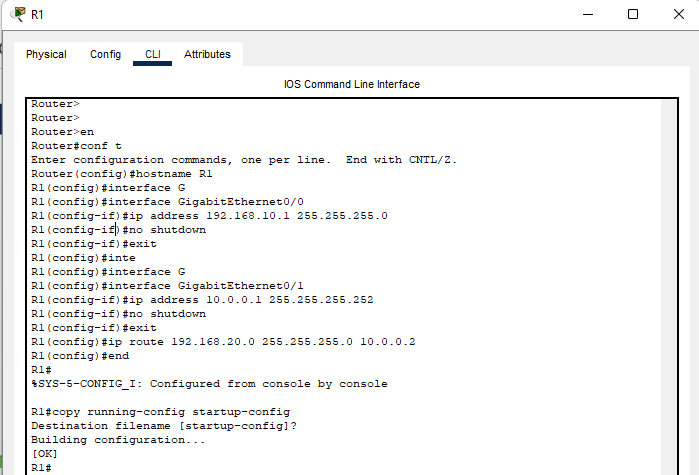

### Router R2 Running Configuration

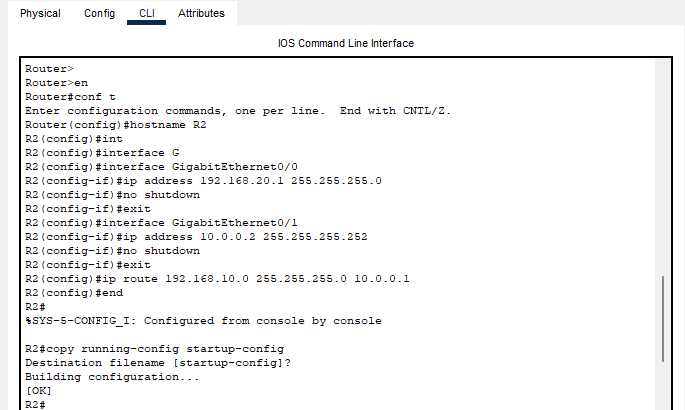

### Switch S1 Running Configuration

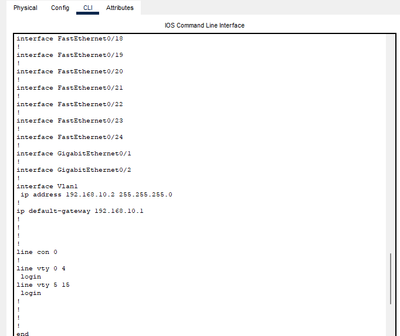

### Switch S2 Running Configuration

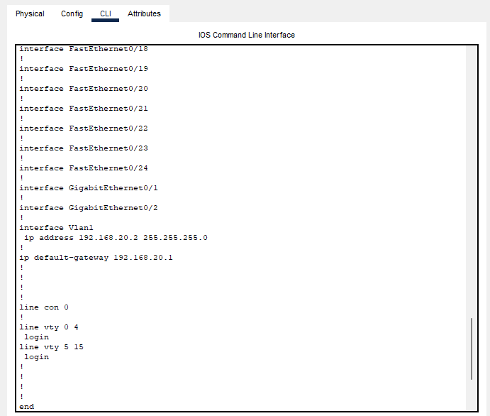

### Static Route Configuration (R1)

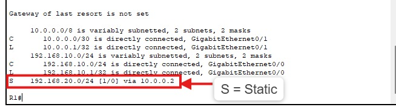

### Static Route Configuration (R2)

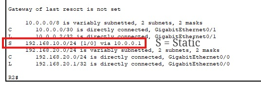

### Routing Table (R1)

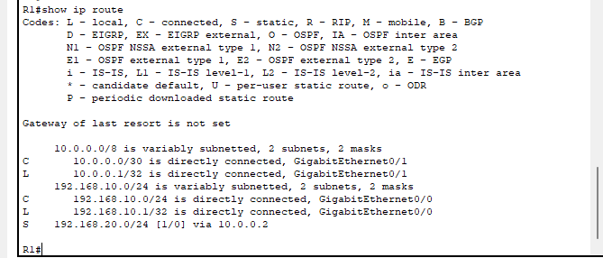

### Routing Table (R2)

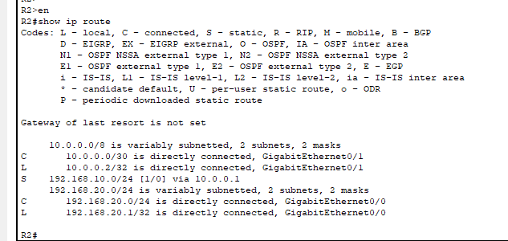

---

## Connectivity Verification

Connectivity was verified using ICMP Echo Requests after completing the configuration.

### PC1 to PC2

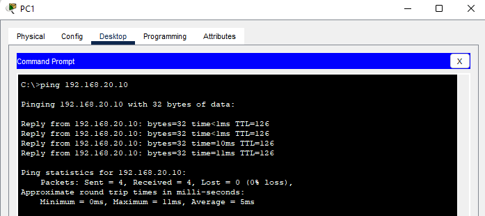

### PC1 to Printer

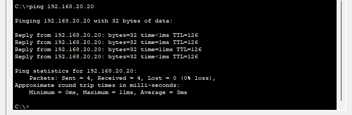

### PC2 to Server

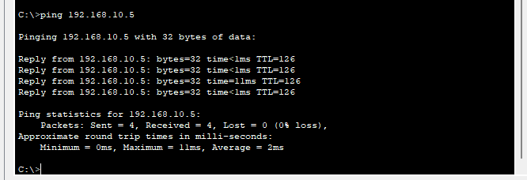

All devices successfully exchanged ICMP Echo Request and Echo Reply messages across both LANs.

---

## Technologies Used

- Cisco Packet Tracer
- Cisco IOS
- Ethernet
- IPv4
- Static Routing
- ICMP

---

## Skills Demonstrated

- Multi-LAN network design
- IPv4 addressing
- Cisco IOS configuration
- Router configuration
- Layer 2 switch configuration
- Static route configuration
- Routing table verification
- Inter-network communication
- Network verification using ICMP
- Basic routing troubleshooting
- Technical documentation

---

## Files

| File                         | Description                                                    |
|------------------------------|----------------------------------------------------------------|
| Two-LANs-Static-Routing.pkt  | Cisco Packet Tracer project                                    |
| configs/                     | Router and switch configuration files                          |
| screenshots/                 | Topology, configuration, routing, and verification screenshots |
| notes/                       | Project observations and documentation                         |

---

## Future Improvements

This network can be extended by implementing:

- Dynamic Routing Protocols (OSPF)
- Virtual Local Area Networks (VLANs)
- Access Control Lists (ACLs)
- Dynamic Host Configuration Protocol (DHCP)
- Network Address Translation (NAT)
- Redundant routing
- Internet connectivity
- Network monitoring and management

---

## Author

**Ziad ZARABI**

Networking Portfolio

GitHub Repository: **Networking-Labs**