# Small Business VLANs

## Overview

This project simulates the design and deployment of a segmented Local Area Network (LAN) for a small business using Cisco Packet Tracer. The objective is to improve network organization and security by separating departments into different Virtual Local Area Networks (VLANs) while following networking best practices.

The project demonstrates VLAN creation, port assignment, Layer 2 switch configuration, IPv4 addressing, network verification, and technical documentation.

## Scenario

A growing small business has expanded its internal departments and requires logical network segmentation to improve security, performance, and administration.

As the network engineer, the objective is to configure VLANs for each department, assign switch ports accordingly, and validate that devices within the same VLAN can communicate while communication between different VLANs remains isolated.

## Objectives

- Design a segmented small business network.
- Configure a Cisco Layer 2 switch.
- Create multiple VLANs.
- Assign switch ports to VLANs.
- Configure end devices with static IPv4 addressing.
- Verify VLAN membership.
- Validate Layer 2 communication.
- Document the complete network implementation.

## Requirements

- Cisco Packet Tracer 8.2.2
- Basic knowledge of IPv4 addressing
- Basic understanding of Ethernet and Layer 2 switching
- Basic understanding of VLANs
- 1 Cisco router
- 1 Cisco Layer 2 switch
- 2 PCs
- 1 server
- 1 network printer

## Network Topology

| **Device** | **Quantity** |
| ---------- | ------------ |
| Cisco Router | 1 |
| Cisco Switch | 1 |
| PCs | 2 |
| Server | 1 |
| Network Printer | 1 |

The following diagram illustrates the physical topology of the network.

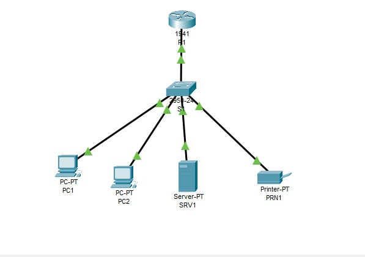

## VLAN Plan

| **VLAN ID** | **VLAN Name** | **Devices** |
| ----------- | ------------- | ----------- |
| 10 | ADMIN | PC1 |
| 20 | SALES | PC2 |
| 30 | SERVICES | SRV1, PRN1 |

## Port Assignment

| **Switch Port** | **Connected Device** | **Port Mode** | **VLAN** |
| --------------- | -------------------- | ------------- | -------- |
| FastEthernet0/1 | PC1 | Access | 10 |
| FastEthernet0/2 | PC2 | Access | 20 |
| FastEthernet0/3 | SRV1 | Access | 30 |
| FastEthernet0/4 | PRN1 | Access | 30 |
| FastEthernet0/24 | Router R1 | Access* | 1 |

> **\*** FastEthernet0/24 is currently configured as an access port in
> VLAN 1 and is reserved for a future Router-on-a-Stick / Inter-VLAN
> Routing implementation.

## IP Addressing Plan

| **Device** | **Interface** | **IP Address** | **Subnet Mask** | **Default Gateway** |
| ---------- | ------------- | -------------- | --------------- | ------------------- |
| PC1 | FastEthernet0 | 192.168.10.10 | 255.255.255.0 | N/A |
| PC2 | FastEthernet0 | 192.168.20.10 | 255.255.255.0 | N/A |
| SRV1 | FastEthernet0 | 192.168.30.5 | 255.255.255.0 | N/A |
| PRN1 | FastEthernet0 | 192.168.30.20 | 255.255.255.0 | N/A |

> **Note:** Default gateways are intentionally not configured because
> inter-VLAN routing is not implemented in this lab. Inter-VLAN routing
> will be introduced in a future routing lab.

## Network Requirements

The network must satisfy the following requirements:

- ADMIN devices must belong to VLAN 10.
- SALES devices must belong to VLAN 20.
- SERVICES devices must belong to VLAN 30.
- End devices must use static IPv4 addressing.
- Devices within the same VLAN must be able to communicate.
- Devices in different VLANs must remain isolated at Layer 2.
- Inter-VLAN routing must not be implemented in this lab.

## Project Structure

```text
03-Small-Business-VLANs/
│
├── README.md
├── Small-Business-VLANs.pkt
│
├── configs/
│   ├── R1.txt
│   └── S1.txt
│
├── screenshots/
│   ├── network-topology.png
│   ├── switch-running-config.png
│   ├── show-vlan-brief.png
│   ├── mac-address-table.png
│   ├── pc1-ip-configuration.png
│   ├── pc2-ip-configuration.png
│   ├── server-ip-configuration.png
│   ├── printer-ip-configuration.png
│   ├── ping-server-to-printer.png
│   ├── ping-pc1-to-pc2-failed.png
│   └── ping-pc1-to-server-failed.png
│
└── notes/
    └── observations.md
```

## Configuration Tasks

### Router R1

- Configure the hostname as R1.
- Enable GigabitEthernet0/0.
- Keep GigabitEthernet0/0 without an IP address.
- Reserve the R1-to-S1 link for a future Router-on-a-Stick implementation.
- Save the running configuration.

Configuration file: `configs/R1.txt`

### Switch S1

- Configure the hostname.
- Create VLAN 10.
- Create VLAN 20.
- Create VLAN 30.
- Assign VLAN names.
- Configure access ports.
- Verify VLAN membership.
- Save the running configuration.

Configuration file: `configs/S1.txt`

### End Devices

- Configure static IPv4 addresses.
- Configure subnet masks.
- Verify communication within the same VLAN.
- Verify isolation between different VLANs.

## Configuration Evidence

### Switch Running Configuration

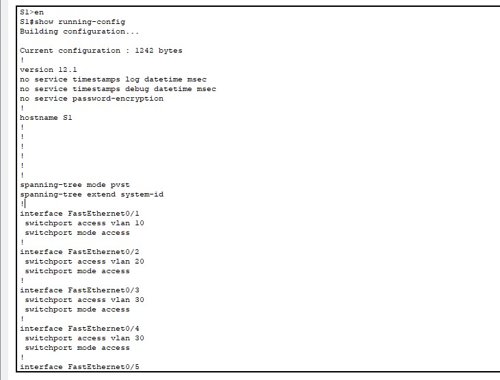

### VLAN Configuration

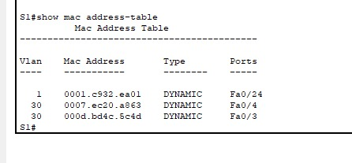

### MAC Address Table

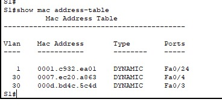

### PC1 IP Configuration

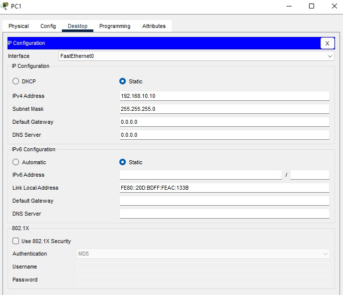

### PC2 IP Configuration

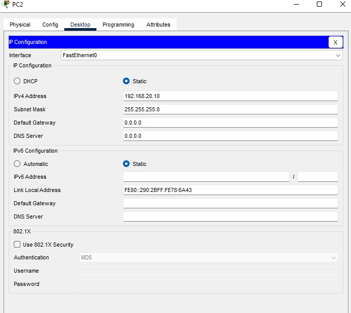

### Server IP Configuration

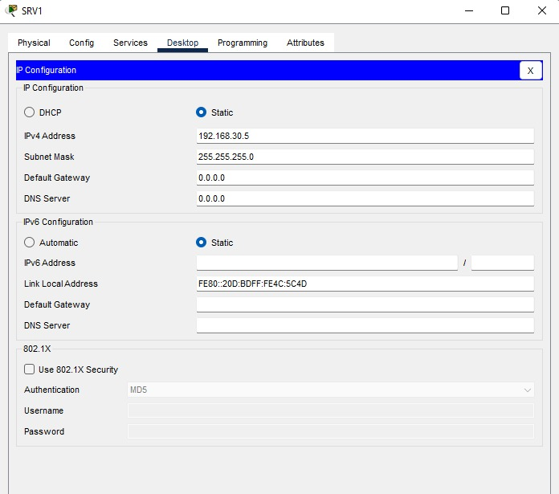

### Printer IP Configuration

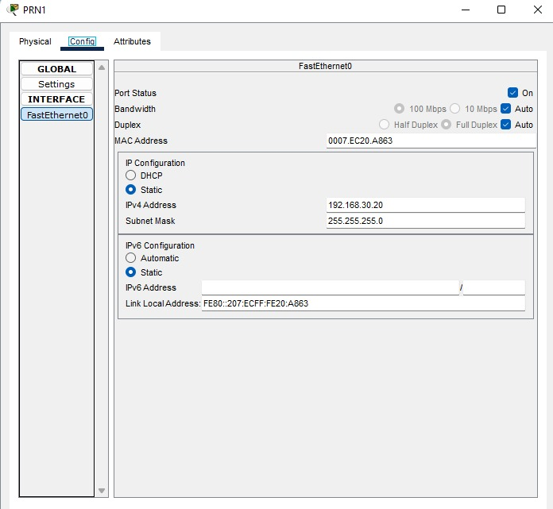

## Verification

The configuration is verified using the following commands:

```text
show vlan brief
show interfaces status
show mac address-table
show running-config
show ip interface brief
```

### VLAN Verification

`show vlan brief` is used to verify VLAN creation and access-port membership.

### Interface Verification

`show interfaces status` is used to verify port status, port mode, and VLAN assignment.

### MAC Address Verification

`show mac address-table` is used to verify MAC address learning on the switch.

## Expected Results

| **Test** | **Expected Result** | **Reason** |
| -------- | ------------------- | ---------- |
| SRV1 → PRN1 | Success | Both devices belong to VLAN 30 |
| PC1 → PC2 | Fail | Devices belong to different VLANs |
| PC1 → SRV1 | Fail | Devices belong to different VLANs |
| PC2 → PRN1 | Fail | Devices belong to different VLANs |

## Connectivity Verification

Connectivity was verified using ICMP Echo Requests after completing
the configuration.

### Server to Printer (Same VLAN)

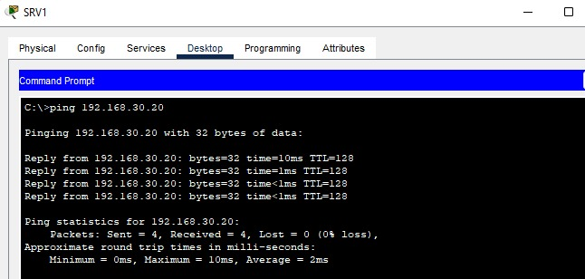

Communication succeeded because both devices belong to VLAN 30.

### PC1 to PC2 (Different VLANs)

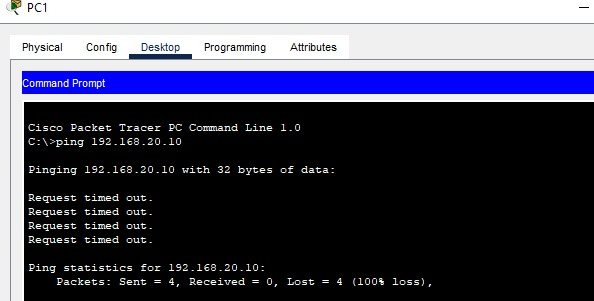

Communication failed because inter-VLAN routing is not configured.

### PC1 to Server (Different VLANs)

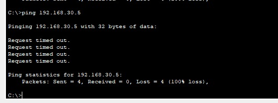

Communication failed because the devices are located in different VLANs.

## Troubleshooting

### Issue: End-device ports were operating in trunk mode

During the initial verification, the ports connected to the end devices
were found to be operating in trunk mode.

**Detection**

```text
show interfaces trunk
```

The command showed Fa0/1 through Fa0/4 operating as trunk ports.

**Resolution**

The ports were explicitly configured as access ports:

```text
interface range FastEthernet0/1 - 4
 switchport mode access
```

**Validation**

```text
show interfaces status
```

The ports were then verified as access ports and assigned to their
expected VLANs.

## Security Considerations

- VLANs provide logical separation between departments.
- Each VLAN represents a separate Layer 2 broadcast domain.
- Inter-VLAN communication is not available in this lab because no
  Layer 3 routing is configured.
- VLAN segmentation alone is not a complete security control.
- Future ACLs and routing policies can be used to control communication
  between VLANs.

## Lessons Learned

- VLANs provide logical network segmentation on a Layer 2 switch.
- Access ports connect end devices to a specific VLAN.
- Multiple access ports can belong to the same VLAN.
- Trunk ports are used when a single link must carry multiple VLANs.
- VLAN membership can be verified using `show vlan brief`.
- MAC address learning can be verified using `show mac address-table`.
- Devices in different VLANs cannot communicate directly at Layer 2.
- Inter-VLAN communication requires a Layer 3 routing mechanism.

## Technologies Used

- Cisco Packet Tracer
- Cisco IOS
- Ethernet
- IPv4
- VLANs
- Layer 2 Switching
- ICMP

## Skills Demonstrated

- VLAN design
- VLAN creation
- VLAN port assignment
- Layer 2 switch configuration
- IPv4 addressing
- Broadcast domain segmentation
- VLAN verification
- MAC address table verification
- Network verification using ICMP
- Technical documentation
- Network troubleshooting

## Files

| **File** | **Description** |
| -------- | --------------- |
| Small-Business-VLANs.pkt | Cisco Packet Tracer project |
| configs/ | Router and switch configuration files |
| screenshots/ | Topology, VLAN configuration, and verification screenshots |
| notes/ | Project observations and documentation |

## Future Improvements

This network can be extended by implementing:

- Router-on-a-Stick
- Inter-VLAN Routing
- Dynamic Host Configuration Protocol (DHCP)
- Access Control Lists (ACLs)
- Network Address Translation (NAT)
- Dynamic Routing Protocols (OSPF)
- Internet connectivity
- Network monitoring and management

---

## Author

**Ziad ZARABI**

Networking Portfolio

GitHub Repository: **Networking-Labs**