# Branch Office Connectivity

## Overview

This project simulates the design and deployment of a small enterprise network connecting a Head Office to a Branch Office using Cisco Packet Tracer.

The objective is to establish reliable site-to-site connectivity between two separate local networks using a point-to-point WAN-style link and static routing.

The project demonstrates branch network architecture, IPv4 addressing, router configuration, static routing, inter-site connectivity, Layer 2 switching, network verification, troubleshooting, and technical documentation.

## Scenario

A growing organization operates from two locations:

- Head Office
- Branch Office

Each location has its own local network and requires communication with the other site.

As the network engineer, the objective is to:

- Design the two-site network.
- Configure the local networks.
- Establish a WAN-style connection between the routers.
- Configure static routes between the two sites.
- Verify end-to-end connectivity.
- Document the complete implementation.

## Objectives

- Design a two-site network architecture.
- Configure Cisco routers and Layer 2 switches.
- Configure IPv4 addressing.
- Establish a point-to-point WAN-style connection.
- Configure static routing between locations.
- Verify routing tables.
- Validate end-to-end connectivity between the Head Office and Branch Office.
- Document the implementation and verification process.

## Requirements

- Cisco Packet Tracer 8.2.2
- Basic knowledge of IPv4 addressing
- Basic knowledge of subnetting
- Basic understanding of routing
- Basic understanding of Layer 2 switching
- 2 Cisco routers
- 2 Cisco Layer 2 switches
- 2 PCs
- 1 server
- 1 network printer

## Network Architecture

The network consists of two separate sites connected through a point-to-point WAN-style link.

```text
                         HEAD OFFICE

        PC1 ───────── S1 ───────── R1
                       │             │
                       │             │
                      SRV1           │
                                     │
                                WAN Link
                                     │
                                     │
                                     R2
                                     │
                                     │
                                     S2
                                   /   \
                                  /     \
                               PC2      PRN1

                       BRANCH OFFICE
```

### Network Topology

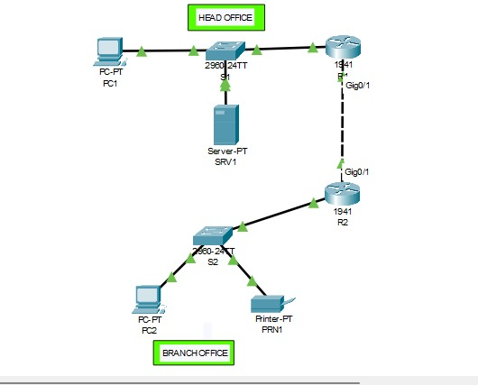

### Head Office

The Head Office uses the network:

`192.168.10.0/24`

Devices:

- R1
- S1
- PC1
- SRV1

### Branch Office

The Branch Office uses the network:

`192.168.20.0/24`

Devices:

- R2
- S2
- PC2
- PRN1

### WAN Link

The routers are connected through the point-to-point network:

`10.0.0.0/30`

- R1: `10.0.0.1`
- R2: `10.0.0.2`

### IP Addressing Plan

| Device | Interface | IP Address | Subnet Mask | Default Gateway |
|---|---|---|---|---|
| R1 | GigabitEthernet0/0 | 192.168.10.1 | 255.255.255.0 | N/A |
| R1 | GigabitEthernet0/1 | 10.0.0.1 | 255.255.255.252 | N/A |
| S1 | VLAN 1 | 192.168.10.2 | 255.255.255.0 | 192.168.10.1 |
| PC1 | FastEthernet0 | 192.168.10.10 | 255.255.255.0 | 192.168.10.1 |
| SRV1 | FastEthernet0 | 192.168.10.20 | 255.255.255.0 | 192.168.10.1 |
| R2 | GigabitEthernet0/0 | 192.168.20.1 | 255.255.255.0 | N/A |
| R2 | GigabitEthernet0/1 | 10.0.0.2 | 255.255.255.252 | N/A |
| S2 | VLAN 1 | 192.168.20.2 | 255.255.255.0 | 192.168.20.1 |
| PC2 | FastEthernet0 | 192.168.20.10 | 255.255.255.0 | 192.168.20.1 |
| PRN1 | FastEthernet0 | 192.168.20.20 | 255.255.255.0 | 192.168.20.1 |

### Port Assignment

#### Head Office — S1

| Switch Port | Connected Device | Port Mode |
|---|---|---|
| FastEthernet0/1 | PC1 | Access |
| FastEthernet0/2 | SRV1 | Access |
| FastEthernet0/24 | R1 | Access |

#### Branch Office — S2

| Switch Port | Connected Device | Port Mode |
|---|---|---|
| FastEthernet0/1 | PC2 | Access |
| FastEthernet0/2 | PRN1 | Access |
| FastEthernet0/24 | R2 | Access |

## Routing Plan

Static routing is used to provide connectivity between the two local networks.

### R1

```text
ip route 192.168.20.0 255.255.255.0 10.0.0.2
```

### R2

```text
ip route 192.168.10.0 255.255.255.0 10.0.0.1
```

These routes provide reachability between the two remote LANs:

- R1 forwards traffic for `192.168.20.0/24` to R2 at `10.0.0.2`.
- R2 forwards traffic for `192.168.10.0/24` to R1 at `10.0.0.1`.

Both forward and return routes are required for successful end-to-end communication.

## Project Structure

```text
04-Branch-Office-Connectivity/
│
├── README.md
├── Branch-Office-Connectivity.pkt
│
├── configs/
│   ├── R1.txt
│   ├── R2.txt
│   ├── S1.txt
│   └── S2.txt
│
├── screenshots/
│
└── notes/
    └── observations.md
```

## Configuration Tasks

### Router R1

Configure the hostname as R1.

Configure the Head Office LAN interface.

Configure the WAN interface.

Enable the interfaces.

Configure a static route toward the Branch Office network.

Save the configuration.

Configuration file:

`configs/R1.txt`

### Router R2

Configure the hostname as R2.

Configure the Branch Office LAN interface.

Configure the WAN interface.

Enable the interfaces.

Configure a static route toward the Head Office network.

Save the configuration.

Configuration file:

`configs/R2.txt`

### Switch S1

Configure the hostname as S1.

Configure the management interface.

Configure the default gateway.

Verify connected ports.

Save the configuration.

Configuration file:

`configs/S1.txt`

### Switch S2

Configure the hostname as S2.

Configure the management interface.

Configure the default gateway.

Verify connected ports.

Save the configuration.

Configuration file:

`configs/S2.txt`

### End Devices

Configure static IPv4 addresses.

Configure subnet masks.

Configure default gateways.

Verify local connectivity.

Verify inter-site connectivity.

## Configuration Evidence

### R1 Configuration

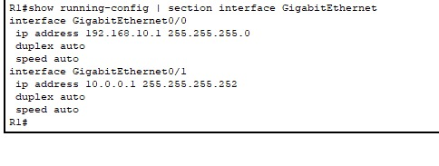

### R2 Configuration

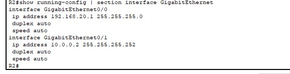

### R1 Interface Verification


### R2 Interface Verification


### S1 Interface Verification

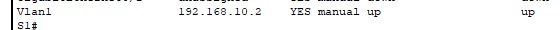

### S2 Interface Verification


### WAN Connectivity

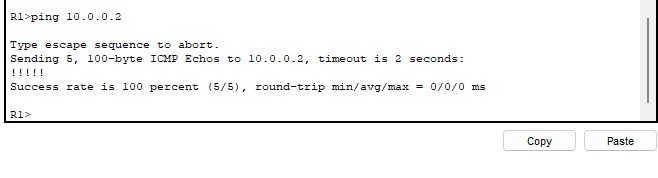

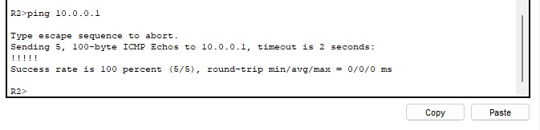

### Routing Tables

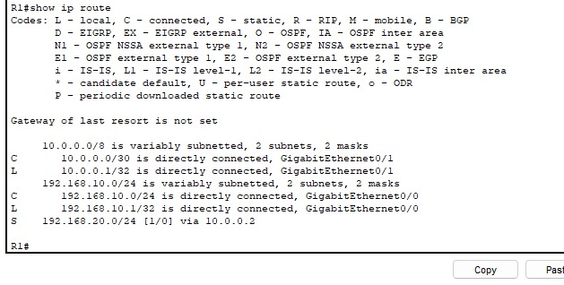

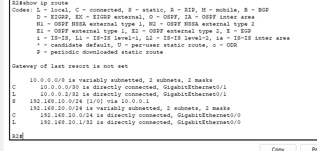

### End Device IP Configuration

#### PC1

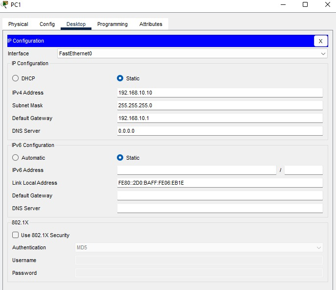

#### PC2

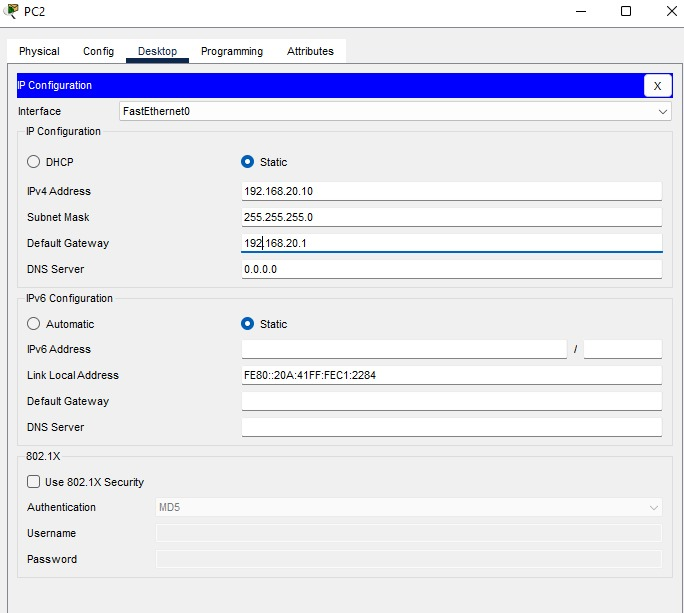

#### SRV1

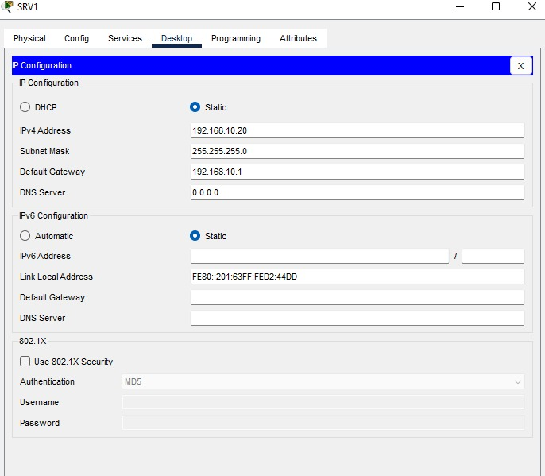

#### PRN1

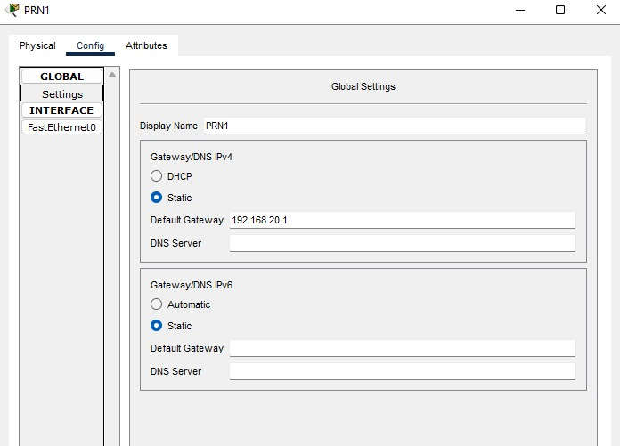

## Verification

The following commands were used to verify the network:

```text
show ip interface brief
show running-config
show ip route
show interfaces status
```

### Interface Verification

`show ip interface brief`

Used to verify interface status and IP addressing.

### Routing Verification

`show ip route`

Used to verify directly connected networks and static routes.

### Switching Verification

`show interfaces status`

Used to verify switch port status and connectivity.

## Expected Results

| Test | Expected Result | Reason |
|---|---|---|
| PC1 → SRV1 | Success | Same Head Office LAN |
| PC2 → PRN1 | Success | Same Branch Office LAN |
| PC1 → PC2 | Success | Static routing between sites |
| PC1 → PRN1 | Success | Static routing between sites |
| PC2 → PC1 | Success | Static routing between sites |
| PC2 → SRV1 | Success | Static routing between sites |
| R1 → R2 | Success | Point-to-point WAN connectivity |

## Connectivity Verification

Connectivity was verified using ICMP Echo Requests.

### Local Head Office Connectivity

PC1 successfully reached SRV1.

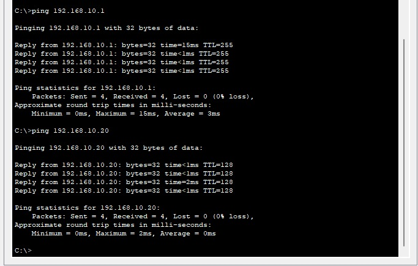

### Local Branch Connectivity

PC2 successfully reached PRN1.

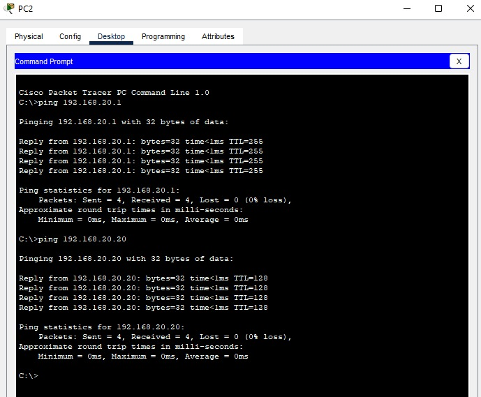

### WAN Connectivity

R1 successfully reached R2 through the point-to-point WAN link.


R2 also successfully reached R1.


### Inter-Site Connectivity

#### PC1 to PC2

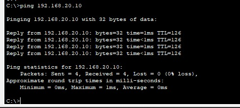

#### PC1 to PRN1

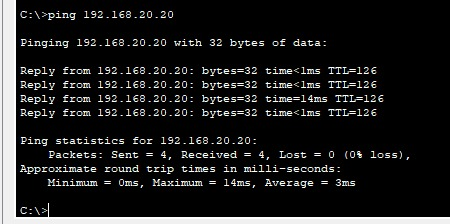

#### PC2 to PC1

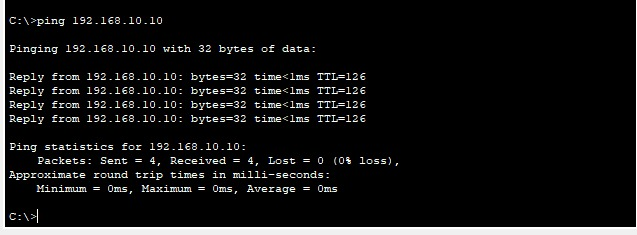

#### PC2 to SRV1

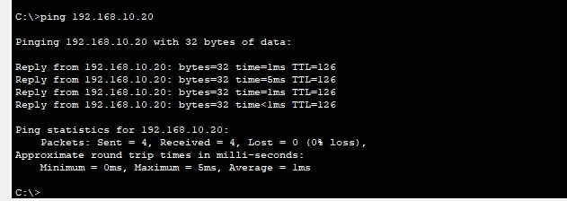

All planned connectivity tests were successfully completed.

## Troubleshooting

### Observed Issue: WAN Interface Not Fully Operational

After configuring R1, GigabitEthernet0/1 initially showed:

```text
up/down
```

The physical interface was enabled, but the remote side of the WAN link had not yet been configured.

After configuring R2 GigabitEthernet0/1 with `10.0.0.2/30` and enabling the interface, the WAN link became:

```text
up/up
```

This confirmed that both ends of the point-to-point connection were properly configured.

### Potential Troubleshooting Areas

Potential troubleshooting areas include:

- Incorrect IP addressing
- Incorrect subnet masks
- Incorrect default gateways
- Disabled router interfaces
- Incorrect static routes
- Incorrect WAN addressing
- Incorrect switch port connections
- Missing return routes

Useful commands include:

```text
show ip interface brief
show ip route
show running-config
ping
traceroute
```

## Security Considerations

Site-to-site connectivity improves communication between locations but does not provide security by itself.

Static routing provides path selection but does not provide traffic filtering, authentication, or confidentiality.

Additional security controls would be required in a real deployment, such as:

- Access Control Lists (ACLs)
- Site-to-site VPN
- Firewall policies
- Network segmentation
- Secure device management
- Network monitoring and logging

## Lessons Learned

- Enterprise networks can consist of multiple local networks connected through routers.
- Each site requires its own IP network.
- Routers provide Layer 3 communication between different networks.
- A point-to-point link can be used to connect two routers.
- Static routes can provide communication between remote sites.
- Both forward and return routes are required for successful end-to-end communication.
- WAN-style links can connect geographically separate networks.
- Routing tables are essential for understanding packet forwarding.
- `show ip route` is useful for verifying routing decisions.
- `show ip interface brief` is useful for validating interface state and addressing.
- End-to-end ICMP testing validates the complete path between sites.
- Verification commands are essential for validating network behavior.

## Technologies Used

- Cisco Packet Tracer
- Cisco IOS
- Ethernet
- IPv4
- Static Routing
- Layer 2 Switching
- ICMP

## Skills Demonstrated

- Network design
- Branch network architecture
- IPv4 addressing
- Subnetting
- Router configuration
- Static routing
- Routing table verification
- Layer 2 switching
- Inter-site connectivity
- Network troubleshooting
- Technical documentation

## Files

| File | Description |
|---|---|
| `Branch-Office-Connectivity.pkt` | Cisco Packet Tracer project |
| `configs/` | R1, R2, S1, and S2 configuration files |
| `screenshots/` | Topology and verification screenshots |
| `notes/` | Project observations and technical notes |

## Future Improvements

This network can be extended by implementing:

- Dynamic routing with OSPF
- Site-to-site VPN
- Access Control Lists (ACLs)
- DHCP
- NAT
- Firewall integration
- Network monitoring
- Redundant WAN connectivity
- IPv6

## Author

**Ziad ZARABI**

Networking Portfolio

GitHub Repository: **Networking-Labs**